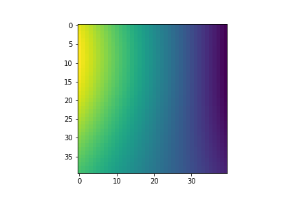
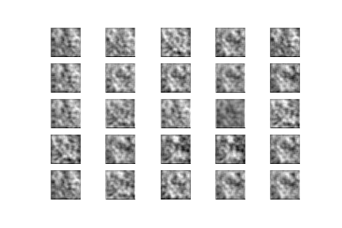
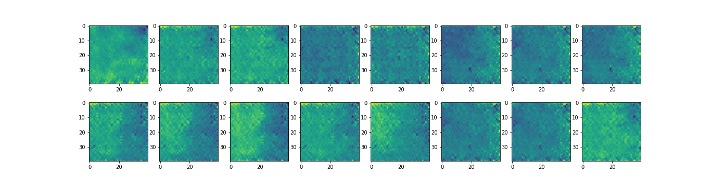
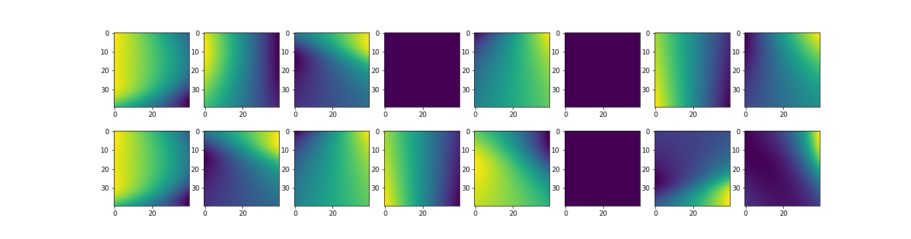
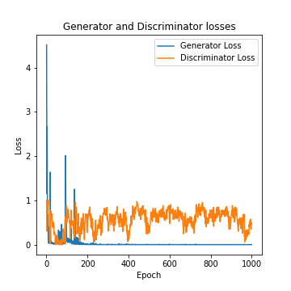
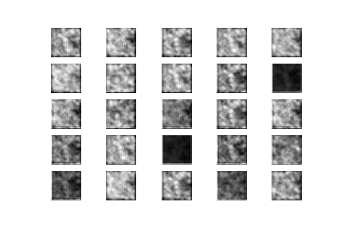
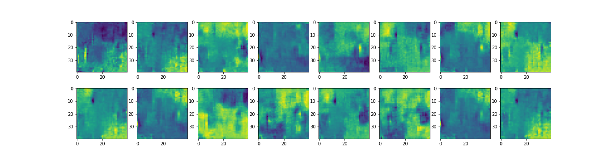
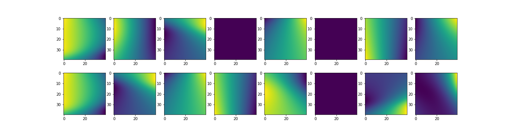
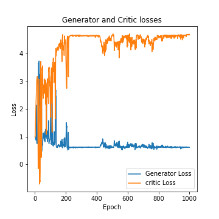

# Deep Learning Models

Collection of different Deep Learning models suggested in research papers, using [Keras](https://keras.io/).
We applied the models to two different [datasets](#datasets). 
Models listed here are some cases simplified versions of the ones ultimately described in papers.

## Table of contents
- [Installation](#installation)

- [About the project](#about-the-project)
    - [Datasets](#datasets)

- [Implementations](#implementations)
    - [Autoencoder - MNIST](#autoencoder-mnist)
    - [Variational Autoencoder - MNIST](#variational-autoencoder-mnist)
    - [DCGAN - MNIST](#dcgan-mnist)
    - [DCGAN - Polynomial](#dcgan-polynomial)
    - [WGAN - Polynomial](#wgan-polynomial)
    

## Installation
    $ git clone https://github.com/LorenzoValente3/Deep-Learning-Models.git
    $ cd Deep-Learning-Models/
    $ sudo pip3 install -r requirements.txt

## About the Project
Two folders hold the project. 
Each of them contains the model implementations tailored to the different datasets they use. 

### Datasets
#### 1. MNIST
The [MNIST database](https://en.wikipedia.org/wiki/MNIST_database) is a handwritten digits dataset. 
The [[class]](./models_using_MNIST/MNIST_dataset.py) implemented in this project includes 60.000 training samples and 10.000 test samples. 
In each image, there are 28x28 pixels, each value ranging from 0 to 255 and a grayscale value.

#### 2. Polynomial
The Polynomial database is a bi-dimensional contour plots dataset. 
The [[class]](./GANs_using_Polynomials/POLY_dataset.py) implemented in this project includes 20000 samples showing polynomial up to a maximum degree (in this case, 5) in two variables.
The size of each image is 40x40 pixels for a 1-channel. 
An image from the dataset is shown below as an example.
The dataset _polydata.npy_ can be downloaded [here](https://drive.google.com/drive/folders/1cuoUMLsSAcC2y_7Xd593NiL-Pm2n6S39?usp=sharing). 

<p align="center">
    
</p>

## Implementations 
### Autoencoder-MNIST
Implementation of a simple _Autoencoder_ (AE) for the MNIST data and an autoencoder that can _classify_ data in its latent dimension is built as well.

#### Model 

The design implemented here uses an architecture in which a _bottleneck_ in the network is imposed.
It forces a compressed knowledge representation of the original input data.
In this implementation, it is used compression in _two-dimensional latent space_.
If the absence of structure in the data occurs, i.e. correlations between input features, compression and subsequent reconstruction would be very difficult. 
However, if some sort of structure exists in the data, this structure can be learned and therefore leveraged when forcing the input through the bottleneck.

#### Results 
Below are plots of the distribution of labelled data in its two-latent dimension space as well as plots of model score losses.
The model has been considered both with and without the classifier for the decompression.
In the latent space, it can be noticed a _linear_ distribution of images. 
This behaviour can be described by the fact that we have two dimensions to express a handwritten digit, then it could happen that the height increases and the width increase as well, linearly as displayed. 
Model score losses converge at high epochs as expected.

| Autoencoder without classifier                                                                               | Autoencoder with classifier  |
| ------------------------------                                                                              | -------------------------   |
|<p float="center">                                    |                                                                                                                                                      |
|      |                                                                                             |
</p>

#### Run Example
```
$ cd models_using_MNIST/
$ ipython AE.ipynb
```
[[Code]](models_using_MNIST/AE.ipynb)

### Variational Autoencoder-MNIST
Implementation of _Variational Autoencoder_ (VAE) with factorized Gaussian posteriors,  and standard normal latent variables .
The variational autoencoder able to _classify_ data in its latent dimension is built as well. 

#### Model
In contrast with the previous _Standard Autoencoder_, the final part of the *encoder* structure bottleneck has two Dense layers: `self.encoded_mean` and `self.encoded_var`, respectively.
In this case, we need a two-dimensional mean and variance as well.These two layers are used for the *sampling trick implementation*, which help us to impose multi-gaussian distribution on the latent space.  
A `Lambda Layer` is created.
It takes both of the previous two layers and measures them to the latent space dimension, via the `self.sampling` implemented function (_Reparametrization trick_).
The sampling creates a structure that is a mixture of multiple Gaussian distributions. 
The remaining part of the encoder architecture is built in perfect analogy with the previous standard autoencoder as well as the _Decoder_ architecture.

#### Results 
In analogy with the previous implementation, below are plots of the distribution of labelled data in its two-latent dimension space as well as plots of model score losses.
The model has been considered both with and without the classifier for the decompression part.
To visualize the results in the latent space the model for the encoder structure is built.
In this case, the distribution of images in latent space is no more linear, but _point clouds_. 
This happens because we impose a Gaussian mixture model on the latent space and as is expected, we have K-different point clouds, that represents one digit each.
Model score losses converge at high epochs as expected.

| VAE without classifier                                                                            | VAE with classifier         |
| ------------------------------                                                                      | -------------------------   |
|<p align="center">                                                                                                      |                                                                                                                                              |
|                                                                                                       |                                                                         |
</p>


#### Run Example
```
$ cd models_using_MNIST/
$ ipython VAE.ipynb
```
[[Code]](models_using_MNIST/VAE.ipynb) [[Paper]](https://arxiv.org/abs/1312.6114)

### DCGAN-MNIST
Implementation of _Deep Convolutional Generative Adversarial Network_ (DCGAN) with a custom training loop that aims at generating MNIST samples. 

#### Model
A GAN's *discriminator* is simply a classifier. It attempts to distinguish between actual data in the dataset and data created by the generator.
A GAN's *generator* learns to create fake data by incorporating feedback from the discriminator. It learns to make the discriminator classify its output as real.

In this implementation, a hundred dimension is given as noise dimension seed to allow the _generator model_ to generate new handwritten digits, starting from random input.

A single measure of distance between probability distributions determines the *generator* and *discriminator losses*.
The generator can only be affected by the term that represents the distribution of _fake_ data.
Therefore, during generator training, we drop the term reflecting the distribution of _real_ data.
The _Adam_ optimizer with small learning rate is considered as version of gradient descend.
Instead, the discriminator loss is computed using both the _real_ and _fake_ data.  
Both of the losses are computed via the cross-entropy function between:
* real output, i.e. discriminator of real data,
* fake output, i.e. discriminator of generated images, 
* ones and zeros-like tensor labels, when we consider real or fake images respectively.

We then loop over the epochs and every batch.
For every training batch, we calculate generator and discriminator loss and store the record.

#### Results 
Below the generated images over 500 epochs embedded in a _gif_ is shown as well as the generator and discriminator training losses stored during the training process.
From the plot we can see how changes in loss fluctuation decrease gradually and that loss becomes almost constant towards the end of training.

<p align="center">
    
                                                                        
</p>

#### Run Example
```
$ cd models_using_MNIST/
$ ipython DCGAN_mnist.ipynb
```
[[Code]](models_using_MNIST/DCGAN_mnist.ipynb) [[Paper]](https://arxiv.org/abs/1511.06434)



### DCGAN-Polynomial
Implementation of _Deep Convolutional Generative Adversarial Network_ with a custom training loop that aims at generating Polynomial data samples.

#### Model
A different implementation of the  _DCGAN model_. 
In this case, the *generator* and *discriminator* models are adapted on a different dataset with different image sizes, as previously described.
The main difference with the previous implementation is the custom training function: we use the in-built *model.train_on_batch* method from the _models_ defined beforehand, and then we loop the training step over the epochs and compute the losses. 

#### Results
Below are shown the generated images after 1000 epochs and the original dataset as well.
The generator and discriminator training losses stored during the training process are plots.
Due to the large fluctuations in the discriminator values, we can not observe an equilibrium between generator and discriminator losses.
This result suggests that this implementation needs to be improved.

<p align="center">
     
                                                         
</p>


<p align="center">
    
                                                                        
</p>

#### Run Example
```
$ cd GANs_using_Polynomials/
$ ipython DCGAN_poly.ipynb
```

[[Code]](GANs_using_Polynomials/DCGAN_poly.ipynb) 



### WGAN-Polynomial
Implementation of _Wasserstein Generative Adversarial Network_ (WGAN) with a custom training loop that aims at generating Polynomial data samples.

#### Model
In contrast to the DCGAN discussed above, this model applies a variation of the standard GAN called _Wasserstein GAN_, in which the discriminator does not properly classify instances.
For this reason, the discriminator is now called *critic*. 
It tries to make the output bigger for real instances than for fake instances, in particular: 
* the *critic loss* tries to maximise the difference between the output on real instances and the output on fake instances.
* the *generator loss* tries to maximize the discriminator's output for its fake instances.

Our new WGAN uses minus-one and one-like tensor labels for real and fake images, instead of ones and zeros, as well as the _RMSProp_ version of gradient descent with a small learning rate and no momentum. 

Wasserstein GANs are theoretically justified by requiring their weights _clipped_,  so they remain within a constrained range after each mini-batch update.
Generally, Wasserstein GANs are less susceptible to getting stuck and avoid vanishing gradient problems. 
 In addition, the _earth mover distance_ has the advantage of being a _true metric_, i.e. a measure of distance in probability space of distributions. 
Cross-entropy considered as loss before is not a metric in this sense.

#### Results
Below the generated images after 1000 epochs and the original dataset are shown.
The generator and critic training losses stored during the training process are plotted as well.
For this latter plot, we can see that the stability has increased concerning the previous implementation, due to the stability given by the new metric.

<p align="center">
     
                                                         
</p>

<p align="center">
    
                                                                        
</p>

#### Run Example

```
$ cd GANs_using_Polynomials/
$ ipython WGAN_poly.ipynb
```

[[Code]](GANs_using_Polynomials/WGAN_poly.ipynb) [[Paper]](https://arxiv.org/abs/1701.07875)