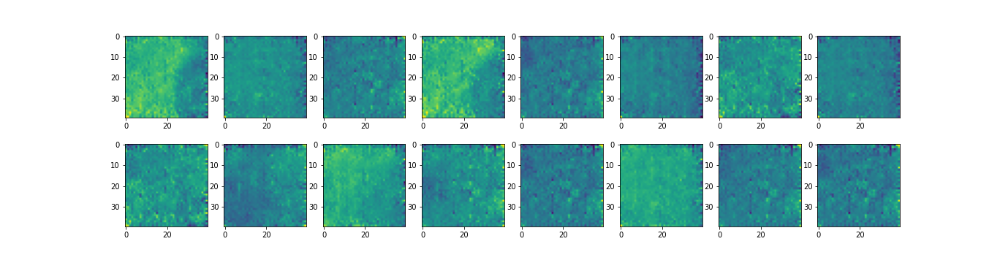
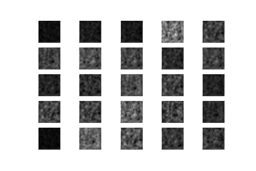
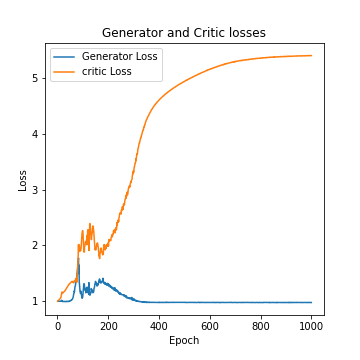

# Deep Learning Models

Collection of different Deep Learning models presented in previously published research papers, using [Keras](https://keras.io/).
These are applied to two different [datasets](#datasets). 
The models listed are simplified versions of the ones ultimately described in papers.

## Table of contents
- [Installation](#installation)

- [About the project](#about-the-project)
    - [Datasets](#datasets)

- [Implementations](#implementations)
    - [Autoencoder - MNIST](#autoencoder-mnist)
    - [Variational Autoencoder - MNIST](#variational-autoencoder-mnist)
    - [DCGAN - MNIST](#dcgan-mnist)
    - [DCGAN - Polynomial](#dcgan-polynomial)
    - [WGAN - Polynomial](#wgan-polynomial)
    

## Installation
    $ git clone https://github.com/LorenzoValente3/Deep-Learning-Models.git
    $ cd Deep-Learning-Models/
    $ sudo pip3 install -r requirements.txt

## About the Project
The project is comprised in two folders, each of them contains the model implementations tailored to the different datasets they use. 

### Datasets
#### 1. MNIST
The [MNIST database](https://en.wikipedia.org/wiki/MNIST_database) is a handwritten digits dataset. 
The [[class]](./models_using_MNIST/MNIST_dataset.py) implemented in this project includes 60.000 training samples and 10.000 test samples. 
In each image, there are 28x28 pixels, each value ranging from 0 to 255 and a grayscale value.

#### 2. Polynomial
The Polynomial database is a bi-dimensional contour plots dataset. 
The [[class]](./GANs_using_Polynomials/POLY_dataset.py) implemented in this project includes 20000 samples showing polynomial up to a maximum degree (in this case, 5) in two variables.
The size of each image is 40x40 pixels for a 1-channel. 
An image from the dataset is shown below as an example.
The dataset _polydata.npy_ can be downloaded [here](https://drive.google.com/drive/folders/1cuoUMLsSAcC2y_7Xd593NiL-Pm2n6S39?usp=sharing). 

<p align="center">
    
</p>

## Implementations 
### Autoencoder-MNIST
Construction of an implementation system of a simple _Autoencoder (AE)_ both for the MNIST data and for data _classification_ in its latent dimension.

#### Model 

The design implemented uses an architecture which imposes a _bottleneck_ on the network.
It forces a compressed knowledge representation of the original input data.
In this implementation, it is used compression in _two-dimensional latent space_.
Compression and reconstruction are extremely demanding if there is no structure in the data, i.e. no correlation between input features. 
However, if some sort of structure exists in the data, it can be learned and applied when forcing the input through the bottleneck.

#### Results 
Plotted below are the distribution of labelled data in its two-latent dimension space, as well as model score losses and classifier accuracies.
The model has been considered both with and without the classifier for the decompression.
In the latent space, it can be noticed a _linear_ distribution of images.
Each of these colored clusters is a type of digit. 
Close clusters are digits that are structurally similar, i.e. digits that share information in the latent space. 
This particular linear distribution describes the fact that we have two dimensions to express a handwritten digit.
Then it could happen for certain digit that the height increases and the width increases as well, creating a linear shape in the latent space, as displayed. 
Model score losses approach zero at high epochs as expected.
After a training phase of 40 epochs, the accuracy of the classifier model respect to the training data has reached the maximum of 99%.
The last images of this section represent the original dataset on the first row and for the second row the reconstructed images after the Autoencoder model is applied.


| Autoencoder without classifier                                                                               | Autoencoder with classifier  |
| ------------------------------                                                                              | -------------------------   |
|<p float="center">                                    |                                                                                                                                                      |
|      |                                                                                             |
</p>

<p align="center">
    
                                                                        
</p>

#### Run Example
```
$ cd models_using_MNIST/
$ ipython3 AE.ipynb
```
[[Code]](models_using_MNIST/AE.ipynb)

### Variational Autoencoder-MNIST
Implementation of _Variational Autoencoder (VAE)_ with factorized Gaussian posteriors,  and standard normal latent variables .
Additionally, a variational autoencoder capable of _classifying_ data in its latent dimension has been built. 

#### Model
In contrast with the previous _Standard Autoencoder_, the final part of the *encoder* structure bottleneck has two Dense layers: `self.encoded_mean` and `self.encoded_var`, as implemented in the class VAE  respectively.
In this case, we need a two-dimensional mean and variance as well. 
These two layers are used for the *sampling trick implementation*, which help us to impose multi-gaussian distribution on the latent space.  
A `Lambda Layer` is created. 
It takes both of the previous two dense layers and measures them to the latent space dimension, via the `self.sampling` implemented function ([_Reparametrization trick_](https://en.wikipedia.org/wiki/Variational_autoencoder#Reparameterization_trick)).
The sampling creates a structure that is a mixture of multiple Gaussian distributions. 
The remaining part of the encoder architecture is built in perfect analogy with the previous standard autoencoder as well as the _decoder_ architecture and the _classifier_.

#### Results 
In analogy with the previous implementation, plotted below are the distribution of labelled data in its two-latent dimension space, as well as model score losses.
To visualize the results in the latent space, an encoder model structure has been built.
The model implemented has been considered both with and without the classifier for the decompression part.
In this case, the distribution of images in latent space is _point clouds_. 
This is because we apply a Gaussian mixture model to the latent space, resulting in K-different point clouds that represent one digit each.

After a training phase of 40 epochs, the accuracy of the classifier model respect to the training data has reached the maximum of 95% and 26.5 for the model loss accuracy for the Variational Autoencoder model without classifier.

| VAE without classifier                                                                            | VAE with classifier         |
| ------------------------------                                                                      | -------------------------   |
|<p align="center">                                                                                                      |                                                                                                                                              |
|                                                                                                       |                                                                         |
</p>


#### Run Example
```
$ cd models_using_MNIST/
$ ipython3 VAE.ipynb
```
[[Code]](models_using_MNIST/VAE.ipynb) [[Paper]](https://arxiv.org/abs/1312.6114)

### DCGAN-MNIST
Implementation of _Deep Convolutional Generative Adversarial Network (DCGAN)_  with a custom training loop aims generating MNIST samples. 

#### Model
A GAN's *discriminator* is simply a classifier. 
It attempts to distinguish between actual data in the dataset and data created by the generator.
A GAN's *generator* learns to create fake data by incorporating feedback from the discriminator. 
It learns to make the discriminator classify its output as real.

In this implementation, a hundred dimension is given as noise dimension seed to allow the _generator model_ to generate new handwritten digits, starting from random input.

A single measure of distance between probability distributions determines the *generator* and *discriminator losses*.
The generator can only be affected by the term that represents the distribution of _fake_ data.
Therefore, during generator training, we drop the term reflecting the distribution of _real_ data.
The _Adam_ optimizer with a small learning rate is considered as a version of gradient descend.
Instead, both the _real_ and _fake_ data are used to compute the discriminator loss.  
The cross-entropy function is used to compute both losses between:
* real output, i.e. discriminator of real data,
* fake output, i.e. discriminator of generated images, 
* ones or zeros-like tensor labels, depending on whether we are considering real or fake images.

We then loop over the epochs and every batch.
For every training batch, we calculate generator and discriminator loss and store the record.

#### Results 
Presented below are the generated images after 500 epochs embedded in a _GIF_  and the generator and discriminator training losses stored during the training process.
The plot illustrates how loss fluctuation decreases gradually and becomes almost constant as training progresses.

<p align="center">
    
                                                                        
</p>

#### Run Example
```
$ cd models_using_MNIST/
$ ipython3 DCGAN_mnist.ipynb
```
[[Code]](models_using_MNIST/DCGAN_mnist.ipynb) [[Paper]](https://arxiv.org/abs/1511.06434)


### DCGAN-Polynomial
Implementation of a _Deep Convolutional Generative Adversarial Network_ with a custom training loop to generate polynomial data samples.

#### Model
A different implementation of the  _DCGAN model_. 
In this case, the *generator* and *discriminator* models are adapted on a different dataset with different image sizes, as previously described.
The main difference with the previous implementation is the custom training function: we use the in-built *model.train_on_batch* method from the _models_ defined beforehand, and then we loop the training step over the epochs and compute the losses. 

#### Results
Below are shown the generated images after 1000 epochs as well as the original dataset.
The generator and discriminator training losses stored during the training process are plotted.
Due to large fluctuations in the discriminator values, an equilibrium cannot be observed between generator and discriminator losses.
This result suggests that this implementation needs to be improved.

<p align="center">
     
                                                         
</p>


<p align="center">
    
                                                                        
</p>

#### Run Example
```
$ cd GANs_using_Polynomials/
$ ipython3 DCGAN_poly.ipynb
```

[[Code]](GANs_using_Polynomials/DCGAN_poly.ipynb) 



### WGAN-Polynomial
Implementation of _Wasserstein Generative Adversarial Network_ (WGAN) with a custom training loop that aims at generating Polynomial data samples.

#### Model
In contrast to the DCGAN discussed above, this model applies a variation of the standard GAN called _Wasserstein GAN_, in which the discriminator does not proper classify instances.
For this reason, the discriminator is now called *critic*. 
It tries to make the output bigger for real instances than for fake instances, in particular: 
* the *critic loss* tries to maximize the difference between the output on real instances and the output on fake instances,
* the *generator loss* tries to maximize the discriminator's output for its fake instances.

Our new WGAN uses minus-one and one-like tensor labels for real and fake images, instead of ones and zeros, as well as the _RMSProp_ version of gradient descent with a small learning rate and no momentum. 

Wasserstein GANs are theoretically justified by requiring their weights _clipped_,  so they remain within a constrained range after each mini-batch update.
Generally, Wasserstein GANs are less susceptible to getting stuck and avoid vanishing gradient problems. 
 In addition, the _earth mover distance_ has the advantage of being a _true metric_, i.e. a measure of distance in probability space of distributions. 
Cross-entropy considered as loss before is not a metric in this sense.

#### Results
Below are shown generated images after 1000 epochs and the original dataset.
The generator and critic training losses during the training process are also plotted.
For the second plot, we can see that the stability has increased due to the new metric that has been used.

<p align="center">
     
                                                         
</p>

<p align="center">
    
                                                                        
</p>

#### Run Example

```
$ cd GANs_using_Polynomials/
$ ipython3 WGAN_poly.ipynb
```

[[Code]](GANs_using_Polynomials/WGAN_poly.ipynb) [[Paper]](https://arxiv.org/abs/1701.07875)